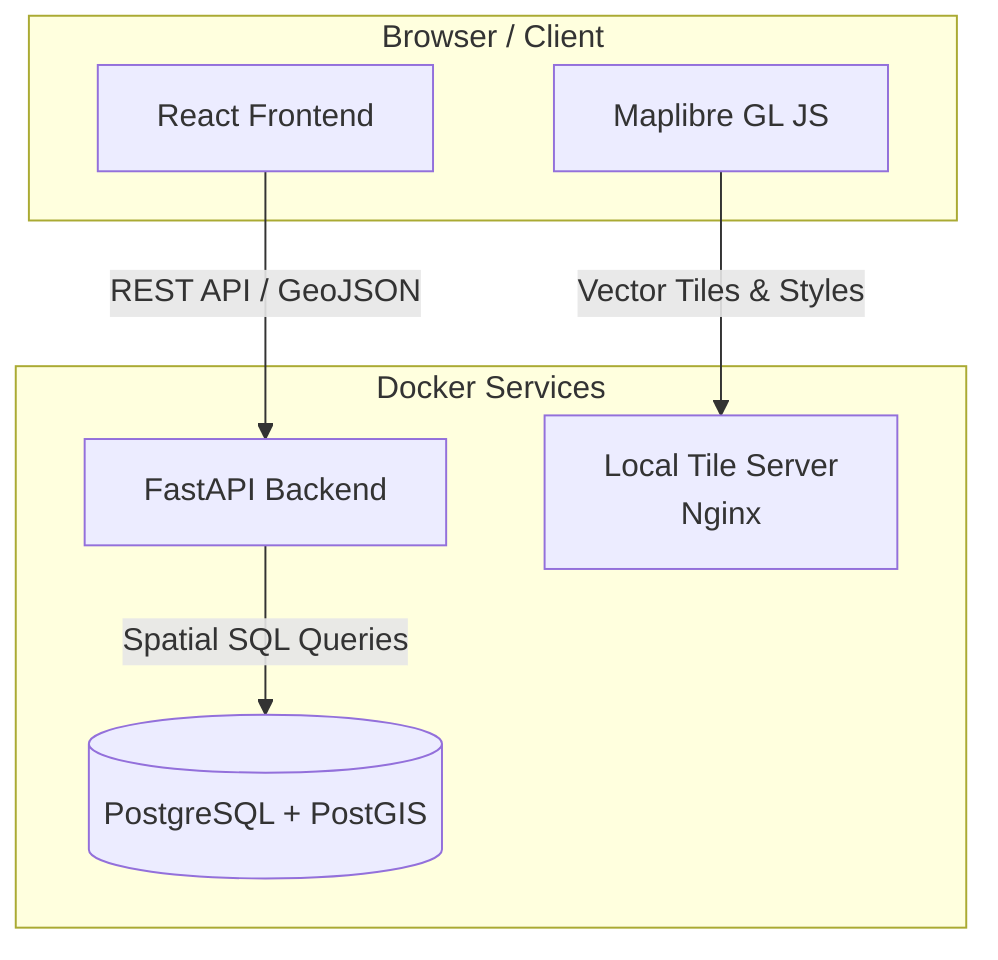

# Intelligent Pipeline System Web App

A complete, production-ready GIS web application for pipeline infrastructure management built with FastAPI, React, PostGIS, and Maplibre GL JS.

## Architecture Overview



## Features

### Map & Visualization (Maplibre GL JS)
- ✅ **Fully Offline Support**: Map tiles served locally via Docker (no internet required).
- ✅ **Interactive Pipe Segments**: Real-time segmentation of pipelines with alternating colors.
- ✅ **Hover Effects**: Instant tooltips showing segment ID, length, and technical specs.
- ✅ **Layer Toggles**: Dynamic switching of segments, stations, valves, and devices.
- ✅ **Fly-to Bounds**: Automatic map centering when selecting a route.

### Backend (FastAPI + PostGIS)
- ✅ **Dynamic Segmentation**: Uses PostGIS `ST_LineSubstring` to generate segment geometry on-the-fly.
- ✅ **GeoJSON API**: Standard-compliant endpoints for all infrastructure features.
- ✅ **Spatial Queries**: Efficient filtering using `ST_DWithin`, `ST_Intersects`, and `ST_Extent`.
- ✅ **Async Architecture**: High-performance non-blocking database operations.
- ✅ **OpenAPI Docs**: Interactive documentation available at `/docs`.

### Database (PostgreSQL + PostGIS)
- ✅ **PODS-Inspired Schema**: Robust data model for pipelines, stations, valves, and devices.
- ✅ **Expanded Dataset**: 6 pipeline systems, 9 major routes (including Gulf-Canada Express).
- ✅ **Seeded Segments**: Pre-populated segments for all routes with realistic attributes.
- ✅ **Spatial Indexing**: GIST indexes for sub-second map queries.

## Quick Start (Docker - Recommended)

The quickest way to run the system with full offline map support.

```bash
# 1. Start all services (Database, Backend, Tile Server, Frontend)
bash quickstart.sh

# 2. Access the Application
# App:  http://localhost:5173
# API:  http://localhost:8000
# Docs: http://localhost:8000/docs
```

The `quickstart.sh` script handles:
- Stopping and cleaning existing Docker volumes.
- Rebuilding images from scratch.
- Clearing the Vite frontend cache.
- Seeding the database with 9 pipeline systems and their segments.

## Project Structure

```
ips/
├── database_schema.sql      # PostgreSQL + PostGIS DDL + Full Seed Data
├── docker-compose.yml       # Multi-container orchestration
├── tileserver.conf          # Nginx config for local map tiles
├── map-data/                # Local MapLibre DemoTiles (cloned on first run)
├── backend/                 # FastAPI application
│   ├── routers/             # API endpoints (segmentation logic here)
│   ├── models.py            # SQLAlchemy/GeoAlchemy2 models
│   └── main.py              # App entry point & CORS
└── frontend/                # React application
    └── src/
        ├── Map.jsx          # Maplibre integration & hover logic
        └── App.jsx          # Main UI & state management
```

## Manual Installation

### 1. Database Setup
```bash
createdb pipeline_gis
psql pipeline_gis < database_schema.sql
```

### 2. Backend Setup
```bash
cd backend
python -m venv venv
source venv/bin/activate
pip install -r requirements.txt
uvicorn main:app --reload
```

### 3. Frontend Setup
```bash
cd frontend
npm install
npm run dev
```

## Usage

### Visualizing Segments
1. **Select a Pipeline**: Choose from the sidebar (e.g., "Gulf-Canada Express").
2. **Segments Enabled**: By default, pipelines are shown as individual segments.
3. **Hover Interaction**: Mouse over any part of the pipeline to see its specific ID, length (miles), and material specs.
4. **Alternating Colors**: Segments use alternating dark/light colors to clearly show break points.

### Feature Details
Click any station or valve icon to see a detailed popup with capacity, pressure ratings, and milepost location.

## API Endpoints

| Endpoint | Description |
|----------|-------------|
| `GET /api/pipelines` | List all systems with metadata |
| `GET /api/pipelines/{id}` | Get full route GeoJSON |
| `GET /api/pipelines/{id}/segments` | Get dynamic pipe segments (LineStrings) |
| `GET /api/pipelines/{id}/stations` | Get point features for stations |
| `GET /api/routes-near-point` | Find routes within X miles of coordinates |

## License
MIT License - Modify and distribute freely

---
**Built with ❤️ using FastAPI, React, PostGIS, and Maplibre**
